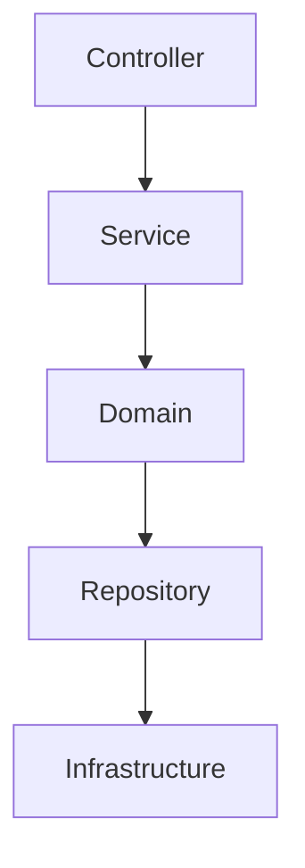

# Arquitetura
## Tipo escolhido de arquitetura
- Layered Architecture (Arquitetura em camadas)

- Camadas:
  - Controller
  - Service
  - DTO (Data Transfer Object)
  - Domain

- Patterns:
  - Repository Pattern


# Escolha de arquitetura

- Layered architecture

### O que caramba é a Arquitetura em camadas?

Arquitetura em camada ela é um sistema divido em camadas logicas. Cada uma dessas camadas tem uma responsabilidade especifica e dependência unidirecional.

## Camadas convencionais / tipicas

1. Controller (API / Web / Interface)

    -> Ele conversa com o "mundo externo", recebe as requisições e repassa para o serviço.

    -> Não deve conter lógica de negócio.

2. Service (Regra de Negócio)

    -> Orquestra regras de negócio, mas ele nao implementa regra, ele so orquestra.

    ex: ``Pra aprovar um pedido de compra, ele precisa verificar se o usuario tem permissão, se o pedido é valido, se o pedido é maior que o limite de aprovação, etc.``

3. Domain ( Modelos / Entidades)

    -> Representa o modelo do negócio.

    -> Não deve conter lógica de persistência.

4. Repository (Persistência)

    -> Responsável por persistir os dados.

    -> Não deve conter lógica de negócio.

5. Infrastructure (Infraestrutura)

    -> Responsável por implementar a infraestrutura.

    -> Não deve conter lógica de negócio.


Fluxo de execução:



```
Controller -> Service -> Domain -> Repository -> Infrastructure
```